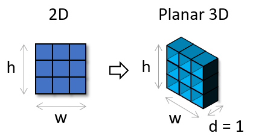
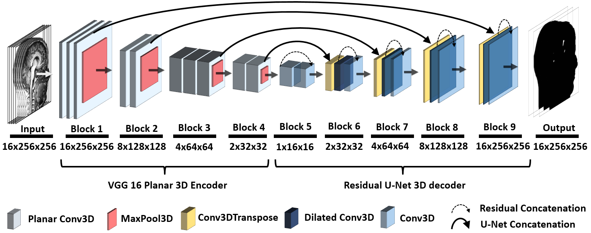

# Planar 3D Transfer Learning
## for End to End Unimodal MRI Unbalanced Data Segmentation
## Utilizing 2D pre-trained weights in 3D segmentation with application on multiple sclerosis lesion segmentation

Hello everyone, this is a repository containing code to Paper "Planar 3D Transfer Learning for End to End Unimodal MRI Unbalanced Data Segmentation" soon to be published (accepted) to ICPR 2020. Pre-print Arxiv version here: https://arxiv.org/abs/2011.11557

Most useful parts of this repository are python keras scripts with source code for generating planar 3D weights for 2D to 3D transfer learning.

## Overview

<p align="center">
   <br>
  <b>Figure_1:</b> Visualisation of 2D → Planar 3D convolutional kernel transformation
</p>

<p align="center">
   <br>
  <b>Figure_2:</b> Architecture of the proposed planar 3D res-u-net with VGG-16 planar 3D encoder
</p>


### Reproducing the paper results
1) Get the data - here is a link to subscribe to the MSSEG 16 challenge, data will be available after manual verification of your team by organizers:
https://portal.fli-iam.irisa.fr/msseg-challenge/overview

2) Download the Unprocessed training dataset and unzip it to the ./msseg folder in the root directory. The path to the first Flair scan should be from the root:
./msseg/Unprocessed training dataset/TrainingDataset_MSSEG/01016SACH/3DFLAIR.nii.gz

3) Run the nifti_to_png.py to generate png processed dataset. The conda environment can be created by running: 
conda create --name planar3d --file environment.txt
this command creates an Anaconda environment called "planar3d" and installs all the necessary packages. If there will be any packages missing, install them via pip and let us know, we will update the Readme.

4) Divide the dataset to the training / test set by copying the folders from data/png/scans and data/png/masks to the corresponding folders data/train_scans - data/train_masks - data/test_scans - data/test_masks. The description of which scans were used as the test scans in each crossvalidation round can be found in the short acoompanying paper to our main ICPR publication. In the first round of crossvalidation the data was divided like this:

```bash
./data/
├── ./test_masks
│   ├── ./test_masks/01042GULE
│   ├── ./test_masks/07043SEME
│   └── ./test_masks/08037ROGU
├── ./test_scans
│   ├── ./test_scans/01042GULE
│   ├── ./test_scans/07043SEME
│   └── ./test_scans/08037ROGU
├── ./train_masks
│   ├── ./train_masks/01016SACH
│   ├── ./train_masks/01038PAGU
│   ├── ./train_masks/01039VITE
│   ├── ./train_masks/01040VANE
│   ├── ./train_masks/07001MOEL
│   ├── ./train_masks/07003SATH
│   ├── ./train_masks/07010NABO
│   ├── ./train_masks/07040DORE
│   ├── ./train_masks/08002CHJE
│   ├── ./train_masks/08027SYBR
│   ├── ./train_masks/08029IVDI
│   └── ./train_masks/08031SEVE
├── ./train_scans
│   ├── ./train_scans/01016SACH
│   ├── ./train_scans/01038PAGU
│   ├── ./train_scans/01039VITE
│   ├── ./train_scans/01040VANE
│   ├── ./train_scans/07001MOEL
│   ├── ./train_scans/07003SATH
│   ├── ./train_scans/07010NABO
│   ├── ./train_scans/07040DORE
│   ├── ./train_scans/08002CHJE
│   ├── ./train_scans/08027SYBR
│   ├── ./train_scans/08029IVDI
│   └── ./train_scans/08031SEVE
```

5) Run the data_load.py to load the png files to numpy ready for neural network input.

6) Download the weights from the 1st round of crossvalidation here:
https://drive.google.com/file/d/1Dq4Q6u0ghqAmiNcdFBvML7-fVzQMj2Hu/view?usp=sharing
and copy them to the ./weights directory

7) Run the original_paper_reproduction.py to generate predictions

8) Run the evaluate_predictions.py which should results in following output:

```bash
------------------------------
Evaluation results of experiment planar_cross_1 : 
------------------------------
(768, 256, 256)
Calculated results for center 1:
Calculated DICE        0.6313213001687128
Calculated Specificity 0.999973596266512
Calculated Sensitivity 0.4655478150728309
Calculated results for center 7:
Calculated DICE        0.6769804285243028
Calculated Specificity 0.999771726259143
Calculated Sensitivity 0.6048149205442954
Calculated results for center 8:
Calculated DICE        0.6704865676549892
Calculated Specificity 0.9984986197405552
Calculated Sensitivity 0.8287365515106169
Calculated complete results:
Calculated DICE        0.6582231144377745
Calculated Specificity 0.9994186303613052
Calculated Sensitivity 0.624245195852427
------------------------------
```
## How to use
TODO

### Applying on your own data
TODO

## Citation and references

Please cite our work as:

TO BE ADDED
